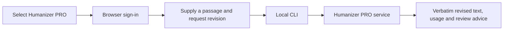

# Using Humanizer PRO through a CLI skill

The user installs the skill, signs in once on Humanizer PRO's hosted page, then uses their local agent's normal conversation. The skill is the instruction layer; the CLI authenticates and performs operations; the existing Humanizer PRO service processes the selected passage and enforces the account allowance.

## 1. Install

Choose the local Codex package or launch Claude Code with the source plugin directory. Use the standalone CLI `.tgz` if you also want the `humanizer-pro` command in your terminal. This file has not been published to npm; do not assume `npm install humanizer-pro-cli` retrieves this product.

## 2. Connect

Ask: **Connect Humanizer PRO.**

The agent runs the local `status` command, starts `login` when needed and presents the emitted authorization URL. You open it on the same computer, sign in, and approve the operation permissions. The CLI confirms completion; the agent then reports the connection. Passwords and tokens stay out of the conversation. No account words are used during sign-in. Authentication may need renewal if the service revokes or expires the connection.

## 3. Use

Ask: **Use Humanizer PRO in academic mode to revise this passage: Our community library offers a quiet place to read. Staff help visitors find books.**

The agent explains the processing provider, word consumption and private history effect, then sends only the supplied passage once through CLI stdin. An ambiguous request is clarified before processing. Unsupported requests are explained without a substitute charged call.

## 4. Read the response

The response has three parts:

| Part | Content |
| --- | --- |
| Revised text | The service's exact returned passage |
| Usage | The service's processed word count and remaining allowance, when returned |
| Review | The service's warning to check facts and meaning |

The following is a **layout example, not a live service result**:

> **Revised text**  
> [The exact text returned by Humanizer PRO appears here.]  
> **Usage**  
> [Processed word count] used · [Returned remaining allowance] left  
> **Review**  
> [The service's review reminder appears here.]

There is no custom app screen or Copy button. Select and copy the text from the conversation. If the service fails, the agent reports the failure and avoids automatic retries. An analysis response shows scores with their uncertainty warning; a balance response shows the actual plan and available words.

## Account and payment

The installed skill and CLI are clients of the existing Humanizer PRO account. They do not grant words or take payments. Rewriting requires existing allowance; analysis does not deduct words. Plan management stays on the service's ordinary website and is not part of the plugin workflow. No separate subscription system is introduced for each agent.

## Where it runs

This release targets a local Codex or Claude Code runtime on macOS/Linux with Node 20.11+ and a browser on that computer. A web/mobile chat cannot use your computer's saved CLI connection just by installing a skill. Use the separately connected Humanizer PRO connector for a hosted chat workflow. Package validation and CLI operation tests are not proof of directory approval or a completed conversational test in every host.
